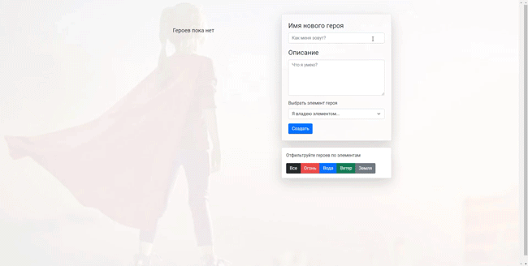

# Hero admin-panel
Admin panel for online games, implemented on a bunch of React + Redux. The application allows you to create, delete and filter heroes in database.

## Getting started
This small project is written to test Redux, uses a [JSON-server](https://github.com/typicode/json-server) to transfer data.

To run the project locally:
* Сlone this repo `git clone https://github.com/xartv/hero_admin_panel.git`
* Run `cd hero_admin_panel` to go to the directory
* Run `npm install` to install all required dependencies
* Run `npm start` to start the local server (this project uses [create-react-app](https://create-react-app.dev/) and [concurrently](https://github.com/open-cli-tools/concurrently) to run [JSON-server](https://github.com/typicode/json-server) in parallel)

